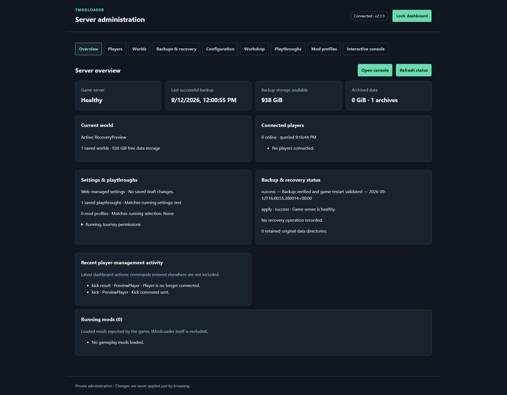
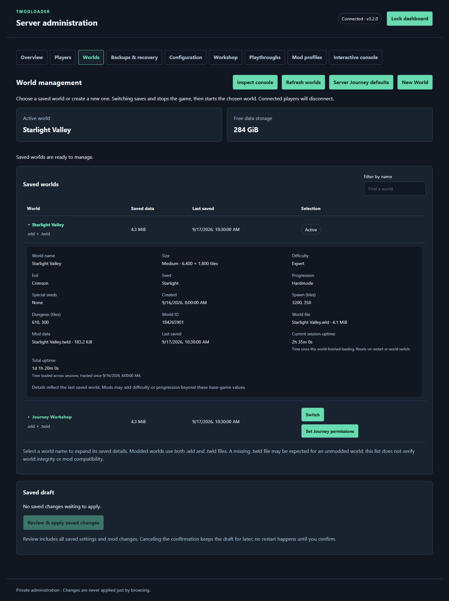
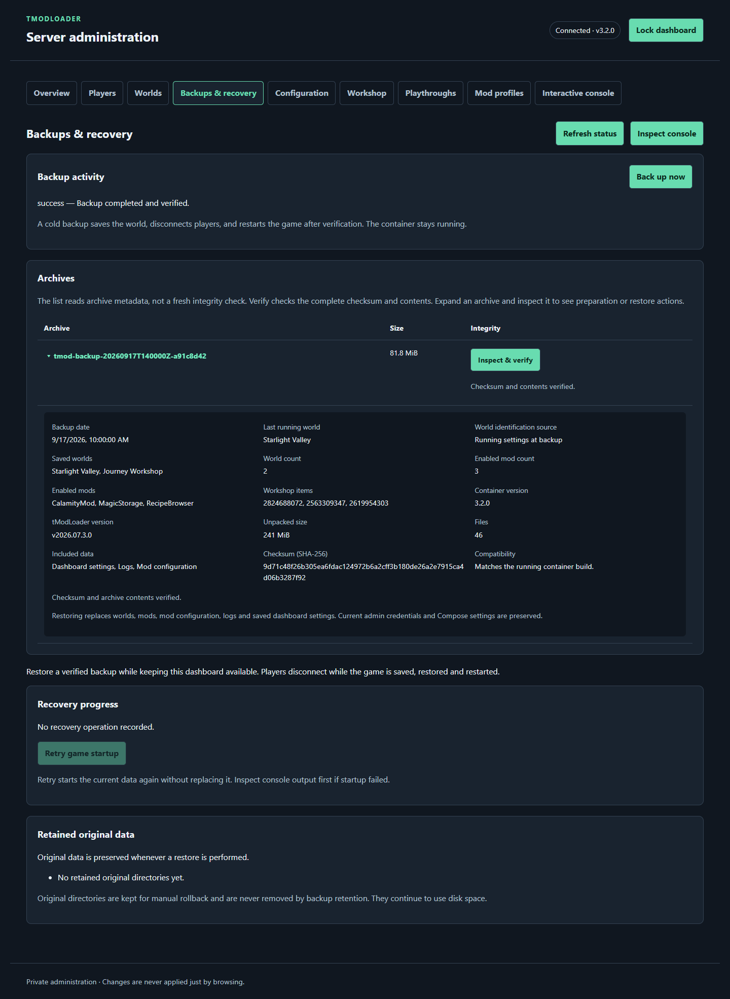
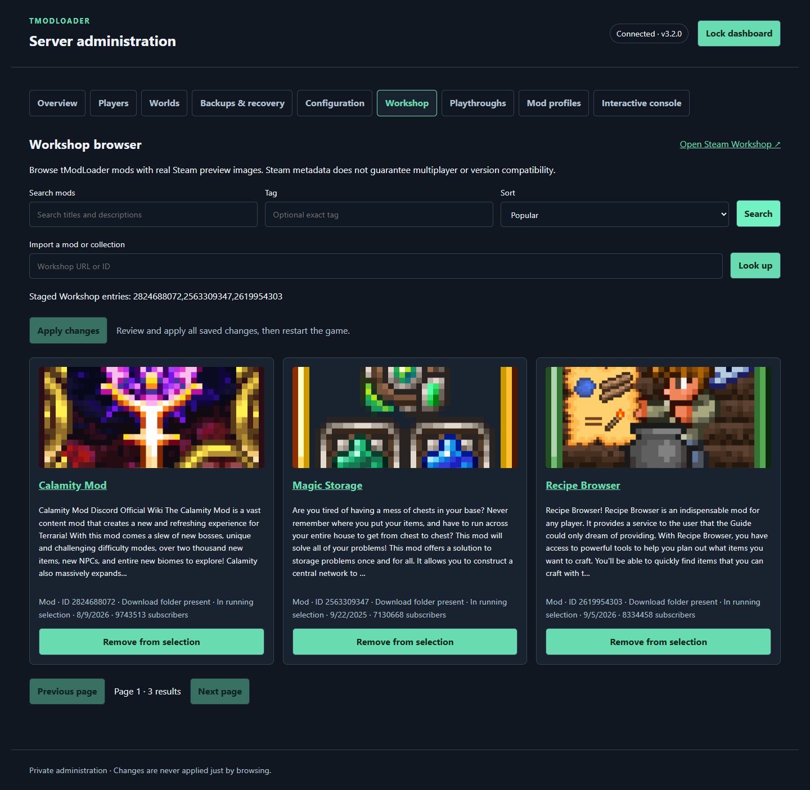

# tModLoader Dedicated Server Container

[](https://github.com/Crosis47/tmodloader/actions/workflows/docker-publish.yml)
[](https://github.com/Crosis47/tmodloader/actions/workflows/docker-ci.yml)

<!-- repository-stats:start -->
[](https://hub.docker.com/r/crosis47/tmodloader)
[](https://hub.docker.com/r/crosis47/tmodloader)
[](https://github.com/Crosis47/tmodloader/pkgs/container/tmodloader)
[](https://github.com/Crosis47/tmodloader/pkgs/container/tmodloader)

[](https://github.com/Crosis47/tmodloader/pkgs/container/tmodloader)
[](https://github.com/Crosis47/tmodloader/stargazers)
[](https://github.com/Crosis47/tmodloader/forks)

[](https://github.com/Crosis47/tmodloader/issues?q=is%3Aissue+is%3Aopen)
[](https://github.com/Crosis47/tmodloader/issues?q=is%3Aissue+is%3Aclosed)
[](https://github.com/Crosis47/tmodloader/pulls)
[](https://github.com/Crosis47/tmodloader/pulls?q=is%3Apr+is%3Amerged)

Updated **2026-09-17 18:19 UTC** · Refreshed hourly · [Metric definitions](docs/repository-stats.md)
<!-- repository-stats:end -->

Run a modded Terraria server in Docker, with a built-in web dashboard for managing
worlds, Workshop mods, players, and backups. Keep your server's data across
container updates and manage it from your browser or Docker Compose.

This independently maintained project has its own features, fixes, and releases.
It is not affiliated with Re-Logic or the tModLoader team.

[Container images](https://github.com/Crosis47/tmodloader/pkgs/container/tmodloader) ·
[Docker Hub](https://hub.docker.com/r/crosis47/tmodloader) ·
[Releases](https://github.com/Crosis47/tmodloader/releases) ·
[Changelog](CHANGELOG.md)

## What it includes

- **Web dashboard:** see server health, loaded mods, connected players, and recent
  activity; send commands through an interactive console.
- **Worlds and playthroughs:** create or switch worlds, save mod profiles, and pair
  a world with its settings and mod selection for later use.
- **Steam Workshop management:** download mods and collections, look up Workshop
  URLs or IDs without an API key, and reuse cached content when Steam is unavailable.
  Workshop search requires a Steam API key.
- **Backups and recovery:** create or schedule backups, verify archives, and restore
  from the dashboard. Backups briefly stop the game and disconnect players.
- **Persistent server data:** worlds, mods, settings, and logs survive container
  replacement. The game and dashboard run as a dedicated non-root user.
- **AMD64 and ARM64 support:** Linux images for both architectures, with automated
  build checks and real-server startup tests before publication.

## Image tags and updates

The release workflow also supports publishing verified images to Docker Hub.
See [Docker Hub publishing setup and retries](docs/dockerhub-publishing.md).

| Tag | Behavior |
| --- | --- |
| `3.0.1` | Fixed stable release; matches the GitHub Release tag |
| `3.0.1-preview` | Fixed preview release; marked as a GitHub prerelease |
| `latest` / `stable` | Follow the latest tested stable build |
| `preview` | Follow the latest tested preview build |

Release notes include the bundled tModLoader version and its upstream release
link. Numbered tags are never overwritten; upstream updates get a new container
version. Previously published tags remain available but receive no new updates.

For Drydock, use a numbered stable tag and opt into version updates with this
Compose label (the double dollar sign escapes Compose interpolation):

```yaml
labels:
  - 'dd.tag.include=^[0-9]+\.[0-9]+\.[0-9]+$$'
```

This restricts updates to stable container versions. The image's source label
points to this repository, where matching release tags provide release notes.
See [Drydock's getting started guide](https://getdrydock.com/docs/v1.7/getting-started).

## Dashboard gallery

Captured from the current 3.2.0 dashboard interface with demonstration server data.
Workshop cards show real public Steam titles and artwork in an illustrative results
list. Select a screenshot to view it full size.

| Overview | Worlds |
| :---: | :---: |
| [](docs/images/dashboard-overview.png) | [](docs/images/dashboard-worlds.png) |
| Health, players, settings, and backup status | World details, uptime, creation, and Journey permissions |

| Backups & recovery | Steam Workshop search |
| :---: | :---: |
| [](docs/images/dashboard-backups.png) | [](docs/images/dashboard-workshop.png) |
| Archive contents, verification, and compatibility | Search controls, Steam preview artwork, and mod selection |

Live Workshop browsing requires a Steam API key. Importing a Workshop URL or ID
works without one.

## Getting started

You need Docker Engine with Compose or Docker Desktop, a 64-bit AMD64 or ARM64
Linux container environment, and enough memory and disk space for your mod pack.
Players need tModLoader clients compatible with the server's version and mods.

### 1. Get the files

Clone this repository, or download [docker-compose.yml](docker-compose.yml) and
[.env.example](.env.example) into the same folder.

```bash
git clone https://github.com/Crosis47/tmodloader.git
cd tmodloader
```

Copy `.env.example` to `.env`:

```bash
cp .env.example .env
```

On Windows PowerShell, use `Copy-Item .env.example .env` instead.

### 2. Choose how to manage settings

Open `.env`. For browser-based configuration, set:

```dotenv
TMOD_CONFIG_SOURCE=web
```

This enables settings edits, world selection, and loading profiles and playthroughs
in the dashboard. Environment values seed the initial settings; afterward, saved
web values take precedence. Save changes in the dashboard, then use **Review &
apply** to apply them and restart the game.

Leave `TMOD_CONFIG_SOURCE=env` to manage settings through `.env` instead. The
dashboard still provides monitoring, console, and backup controls. Set
`TMOD_WEB_ENABLED=0` if you want to run without the dashboard or its setup step.

Review the [essential settings](#essential-settings) below before starting,
particularly the game password, world name, and mods.

### 3. Start and complete setup

```bash
docker compose pull
docker compose up -d
docker compose logs --tail=100 --follow tmodloader
```

With the dashboard enabled, **the game waits for first-run admin setup**:

1. Find the one-time setup code in the container logs.
2. Open `http://SERVER-IP:8080` from your home network, or
   [http://localhost:8080](http://localhost:8080) on the Docker host.
3. Enter the code and choose an admin token (8–256 ASCII characters, no whitespace).
   Save it in your password manager; use it to sign in afterward.

The container saves a hashed credential in the persistent data directory and
continues startup automatically. First-time mod downloads and world generation
can take several minutes. Press `Ctrl+C` to stop following logs without stopping
the server.

HTTP works for clients in `10.0.0.0/8`, `172.16.0.0/12`, and `192.168.0.0/16`
(RFC 1918), plus loopback. Other sources, including non-loopback IPv6, require
HTTPS for setup and all dashboard access. HTTP traffic is unencrypted; use it
only on a trusted network. The server checks the client source IP, not the URL.

Leave `TMOD_WEB_ORIGIN` empty when opening the server IP. For a hostname, set it
to the exact browser origin. For HTTPS through a reverse proxy, also set
`TMOD_WEB_TRUSTED_PROXY` to that proxy's single IP as seen by the container.
The proxy must preserve `Host` and overwrite `X-Forwarded-For` with the actual
single client IP and `X-Forwarded-Proto` with `http` or `https`. Multi-proxy header
chains are rejected. Restrict backend access to the proxy when publishing it.

Docker forwarding or another gateway can hide the original source IP behind a
private address. This rule can only classify the IP the container actually sees;
do not directly port-forward the HTTP dashboard to the internet. Use the HTTPS
proxy with the trusted-proxy setting to preserve the original client identity.

### 4. Join the server

Check readiness in the dashboard or run:

```bash
docker compose ps
```

Once the server is healthy, connect from tModLoader to your Docker host's address
on port **7777** (or your chosen `TMOD_HOST_PORT`). Allow that TCP port through
the host firewall and forward it on your router if players connect over the internet.

## Essential settings

The commented [.env.example](.env.example) contains the full list of options.
These are the main values to review for a new server:

| Setting | Purpose / default |
| --- | --- |
| `TMOD_CONFIG_SOURCE` | `env` for `.env` settings; `web` for dashboard-managed settings. |
| `TMOD_WEB_ENABLED` | `1` enables the dashboard; `0` disables it and skips admin setup. |
| `TMOD_PASS` | Game password, separate from the admin token. Empty means no game password. |
| `TMOD_HOST_PORT` | Port players connect to; defaults to `7777`. |
| `TMOD_WORLDNAME` | Selects a saved world or creates it if missing; defaults to `Docker`. |
| `TMOD_WORLDSIZE` | New world size: `1` small, `2` medium, `3` large (default). |
| `TMOD_DIFFICULTY` | New world difficulty: `0` Classic, `1` Expert (default), `2` Master, `3` Journey. |
| `TMOD_WORLDEVIL` | New world evil: `random` (default), `corruption`, or `crimson`. |
| `TMOD_MODS` | Comma-separated Workshop mod IDs and `collection:ID` entries; empty by default. |
| `TMOD_BACKUP_INTERVAL` | Minutes between backups; `0` disables scheduling, `1440` means daily. |

World creation and Journey permissions live on **Worlds**. **New World** opens the
creation form. For saved Journey worlds, **Server Journey defaults** sets shared
permissions, and **Set Journey permissions** on a world lets you inherit those
values or save an override. Controls are hidden for non-Journey worlds and unreadable
world types. Existing global permissions seed the initial server defaults.

Saving permissions does not change the running game; they take effect when that
world next starts. **Review & apply** stages the selected world and opens the usual
restart confirmation. Per-world overrides survive switching worlds and container
restarts. Applying a playthrough's different Journey snapshot records it as that
world's override. Server defaults remain unchanged.

**Review saved changes** opens a running-versus-saved comparison, including fields
edited outside Configuration. A draft identical to the running settings does not
trigger the saved-changes reminder. Unsaved form edits are not part of this review.

Select a name in **Saved worlds** to expand details from its last save: dimensions,
difficulty, evil, seed, creation date, Hardmode status, special seeds, spawn and
dungeon coordinates, and file sizes. Expanded entries remain open across refreshes.
The current world has a status badge; other worlds have a **Switch** button.
**Current session uptime** starts when the world finishes loading and resets on a
game restart or world switch. **Total uptime** accumulates loaded time across sessions
and persists with the world data. Tracking begins with this feature; earlier sessions
are not included. Totals are checkpointed every five seconds and on normal shutdown;
an abrupt kill can lose up to five seconds. Inactive worlds display **Not active**
for their current session and retain their total. This is not player playtime. Metadata currently supports
world formats 194–279; unreadable or unsupported headers show an explanation while
file details and existing world-selection controls remain available.

World generation settings only affect **new worlds**. Choose an unused world
name to generate a different world. Profiles and playthroughs do not archive
world files or pin mod versions; keep backups before changing a world's mods.

After editing `.env`, recreate the container with `docker compose up -d`.
In web mode, change saved settings in the dashboard. Docker ports, mounts,
credentials, and configuration mode remain managed outside the dashboard.
If you explicitly set `TMOD_WEB_ORIGIN`, update its port when changing the dashboard port.

## Data and backups

The supplied Compose file keeps persistent files beside it:

| Host folder | Contents |
| --- | --- |
| `./data` | Worlds, mods, mod configuration, dashboard settings, and logs. |
| `./backups` | Backup archives created by the container. |

Startup prepares these directories for the runtime user, including changing
Linux host ownership to UID/GID `1000:1000`. Use dedicated, writable local folders.
Keep both folders when replacing the container.

Use **Backups & recovery** in the dashboard for manual backups and restoration.
Scheduled backups are off by default. Keep a separate copy of your `.env` and
any external secret or custom configuration files; container backups do not
include them. Retain the original image version for recovery, since restores
check the container build that created the archive.

Expand an archive row to see its backup date, last running world (when recorded),
world files, enabled mods, Workshop selections, sizes, and included settings/logs.
**Inspect & verify** checks the actual archive and fills in details for older backups.
A saved world selection in an old backup is labeled as such; it is not proof that
that world was running.

When an inspected backup uses the same tModLoader release but a different container
build, **Prepare for Running Container Version** creates a verified copy for the current build.
The original and world data remain unchanged. After inspection, compatible archives
show **Restore this backup** in their expanded details. This opens a review popup
that verifies the archive and available space before you confirm the restore.
Different or unknown game releases cannot be converted automatically: retain the
matching original image. Normal retention preserves backups from other container
builds, so these preserved copies may require additional storage.

## Help and project information

For startup or connection problems, begin with `docker compose ps` and
`docker compose logs --tail=200 tmodloader`. Include relevant logs with an
[issue report](https://github.com/Crosis47/tmodloader/issues), removing private
information first.

- [Configuration template](.env.example)
- [Release history](CHANGELOG.md)
- [Contributing and development](CONTRIBUTING.md)
- [Security reporting](SECURITY.md)
- [License](LICENSE.md)

## Credits

Built on [tModLoader](https://github.com/tModLoader/tModLoader) for
[Terraria](https://terraria.org/). Inspired by
[JACOBSMILE/tmodloader1.4](https://github.com/JACOBSMILE/tmodloader1.4).
Thanks also to [ldericher](https://github.com/ldericher/tmodloader-docker),
[rfvgyhn](https://github.com/rfvgyhn/tmodloader-docker),
[guillheu](https://github.com/guillheu/tmodloader-docker), and
[FlorentLM](https://github.com/FlorentLM/tmodloader1.4) for their earlier work.

Container code and scripts are distributed under [LICENSE.md](LICENSE.md).
Terraria, tModLoader, and bundled third-party tools retain their respective licenses.
